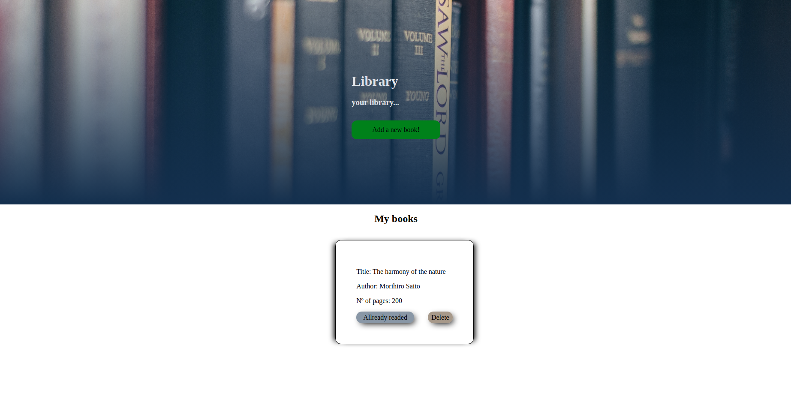

# Library

The library project was build as the first project of the JavaScript module from Microvers. Here the user can add a new book, deleted and marked as a allready readed or not readed.

##  :hammer: Built with:

- Html
- Css
- JavaScript

##  :red_circle: Live Demo:

[Live demo](https://ricardomonte.github.io/library/)

##  :construction_worker: Getting Started

To get a local copy up and running follow these simple steps:

- Go to the main page.
- Press the "Code" button and get the repo link.
- Clone it using git command "git clone".

## :bust_in_silhouette: Author

- Github: [@ricardomonte](https://github.com/ricardomonte)
- Twitter: [@ramnkco](https://twitter.com/ramnkco)
- LinkedIn: [Ricardo Montenegro](https://www.linkedin.com/in/ricardo-antonio-montenegro-nu%C3%B1ez-87a74944/)

## :raised_hand: :raised_hand: Contributions

Contributions, issues and feature requests are welcome!

Feel free to check the [issues here](https://github.com/ricardomonte/Capstone-Project/issues).

## Show your support

Give a :star: if you like this project!.

##  :grey_exclamation: Acknowlegment

- To [Microverse](https://www.microverse.org/)
- Mentor.
- Stand up team

##  :memo: License

This project is [MIT](LICENSE) licensed.
